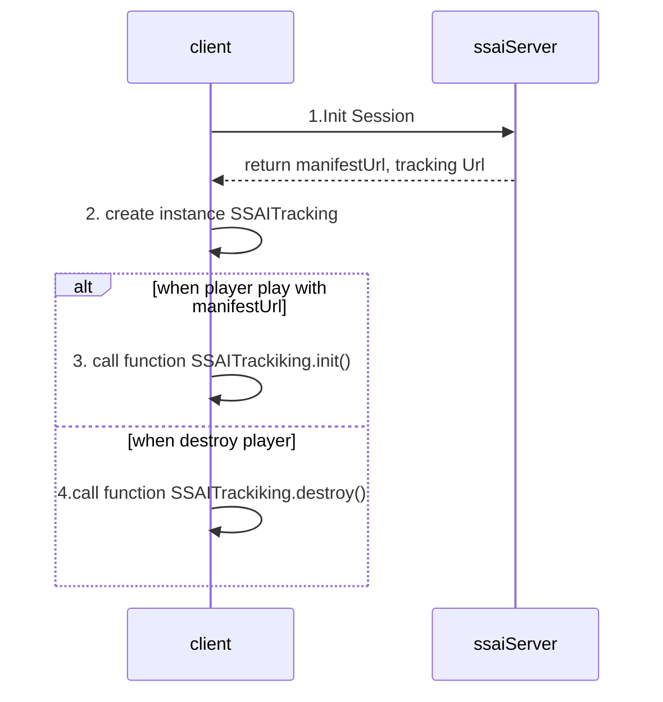

# sigma-ssai-web-sdk

1. Flow


<!doctype html>

<head>
  <!-- STEP 1: Include the SDK -->
  <script src="https://dev-streaming.gviet.vn:8783/micro/cms/sdk-dai/sdk-dai.iife.js"></script>
</head>

<body>
  <!-- STEP 2: Create a container for the video and the ad -->
  <div
    style="
      position: relative;
      width: 720px;
      overflow: hidden;
      aspect-ratio: 16/9;
    "
  >
    <video
      class="videoElement"
      muted
      controls
      playsinline
      preload="auto"
      style="position: absolute; inset: 0; width: 100%; height: 100%"
    />
    <div
      class="adContainer"
      style="
        position: absolute;
        top: 0;
        left: 0;
        bottom: 0;
        right: 0;
        overflow: hidden;
        width: 100%;
      "
    />
  </div>
  <script>
    // STEP 3: on page load
    window.addEventListener('load', function () {
      const video = document.querySelector('.videoElement')
      const adContainer = document.querySelector('.adContainer')
      // url of the manifest
      const url =
        'https://ssai-stream-dev.sigmaott.com/manifest/manipulation/session/97004de4-1971-4577-8f1b-eccb03737fa5/origin04/scte35-av4s-clear/master.m3u8'

      // STEP 4: Create a new instance of the SDK
      window.SigmaDaiSdk.createSigmaDai({ video, adContainer, url }).then(
        ({ onEventTracking }) => {
          onEventTracking('*', (payload) => {
            console.log('[LOG] ~ payload:', payload)
          })
        },
      )
    })
  </script>
</body>

```
