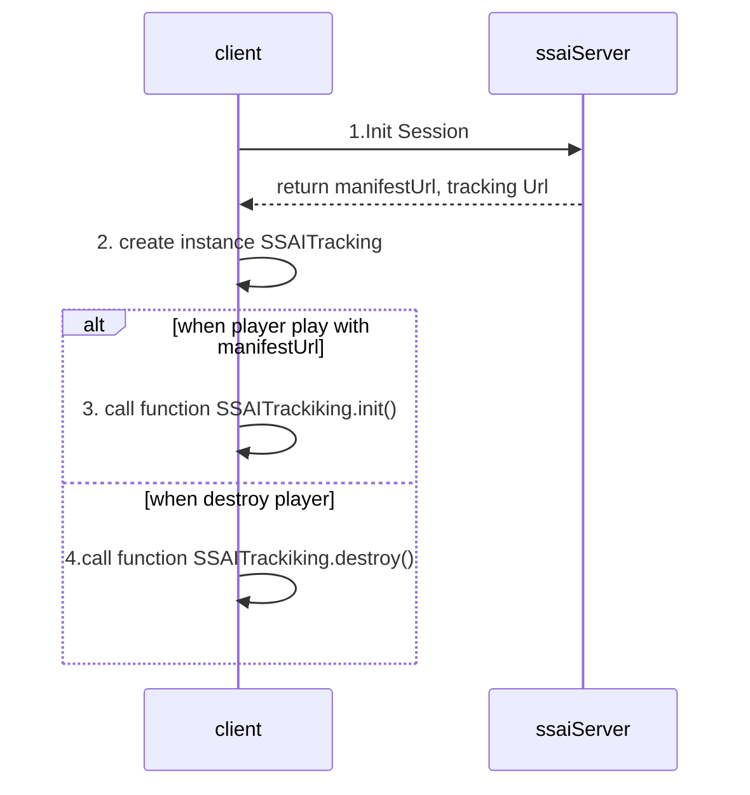

# sigma-ssai-web-sdk

1. Flow



Step 1: Init session

```jsx
const domain = "http://123.31.18.25:2180"
const data = await fetch(`${domain}/manifest/manipulation/session/16480acd-b4a1-4629-abf0-586689c01c5f/origin04/scte35-av4s-clear/master.m3u8`).then(res=>res.json())
const manifestUrl = `${domain}${data.manifestUrl}`
const trackingUrl = `${domain}${data.trackingUrl}`
```

Step 2 :create instance SSAITracking 

```jsx
// Html tag video player
var video = document.querySelector('#player');
const ssaiPlugin = new window.ssaiTracking({ trackingUrl, video, intervalTracking: 1000 })
```

Step 3: when player play with manifestUrl 

```jsx
ssaiPlugin.init()
```

Step 4: player destroy

```jsx
ssaiPlugin.destroy()
```